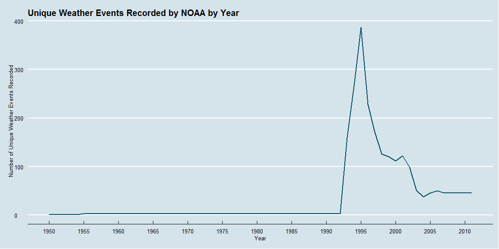
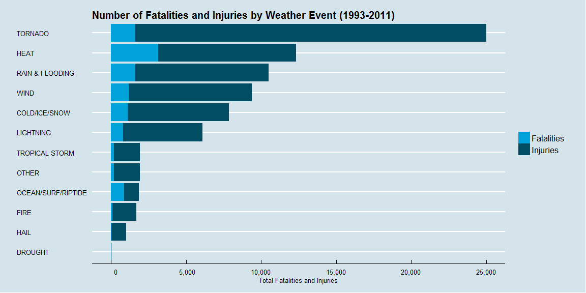
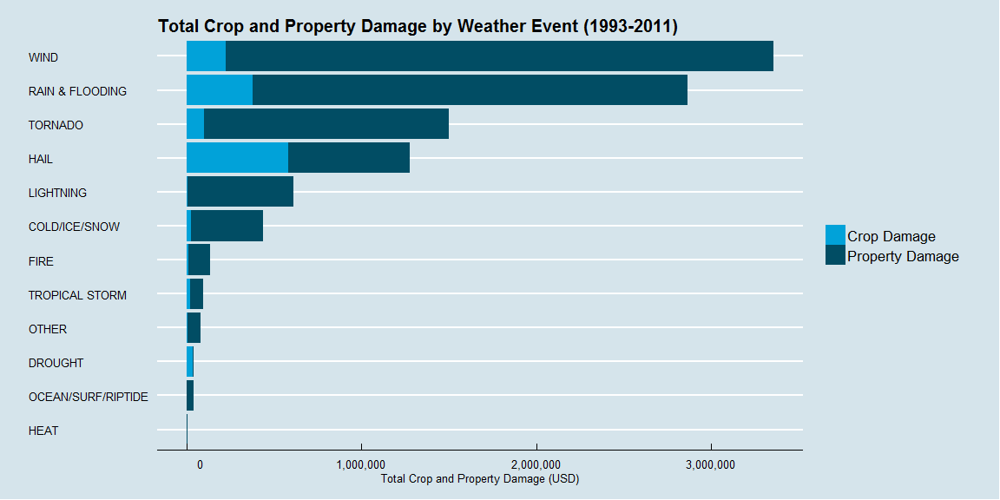

# Extent of Injury, Fatality, and Economic Loss from Severe Weather Events  in the USA from 1993-2011

## Synopsis

This report aims to leverage the NOAA Storm Database to answer two primary questions regarding the adverse effects of severe weather events in the United States. First, it charts the extent of harm caused by different tracked events by finding the aggregate number of injuries and fatalities experienced from 1993-2011. The analysis finds that tornado and heat-related injuries are the most common in this group. Second, it charts the magnitude of economic damage caused by these events by finding the sum of property and crop damage experienced during the same time frame. The analysis finds that wind is the main driver of overall damage while hail leads all weather events with respect to crop damage. Further, the documentation throughout this analysis aims to delineate the steps taken and assumptions made in the process to ultimately drive these conclusions from the raw data supplied.

## Data Processing

This section reviews how the data from the NOAA Storm Database are loaded into R and processed for analysis.

### Loading Required Libraries

The following libraries are loaded to facilitate the processing of data, data analysis and visualization of results.


```r
require(downloader)
```

```
## Loading required package: downloader
```

```r
require(dplyr)
```

```
## Loading required package: dplyr
## 
## Attaching package: 'dplyr'
## 
## The following object is masked from 'package:stats':
## 
##     filter
## 
## The following objects are masked from 'package:base':
## 
##     intersect, setdiff, setequal, union
```

```r
require(ggplot2)
```

```
## Loading required package: ggplot2
```

```r
require(lubridate)
```

```
## Loading required package: lubridate
```

```r
require(reshape2)
```

```
## Loading required package: reshape2
```

```r
require(ggthemes)
```

```
## Loading required package: ggthemes
```

```r
require(knitr)
```

```
## Loading required package: knitr
```

```r
require(plotflow)
```

```
## Loading required package: plotflow
## Loading required package: gridExtra
## Loading required package: grid
```

### Loading Data

We are provided data from the NOAA Storm Database in the form of a comma-separated-value file compressed via the bzip2 algorithm to reduce its size.

The data loading is set up in such a way that, if the `StormData.csv.bz2` file is not present in the working directory, it will download it nonetheless. If the csv.bz2 file is not in working directory, the code will download it from the repository and extract the file to the working directory.


```r
filename <- "StormData.csv.bz2"

if (!file.exists(filename)){
        message("Downloading data file")
        download(url="https://d396qusza40orc.cloudfront.net/repdata%2Fdata%2FStormData.csv.bz2", 
                 destfile="StormData.csv.bz2")
} else {message("Data file found in working directory")}
```

```
## Data file found in working directory
```

### Reading in the Data

Next, the raw data is read in using the `read.table` function. Note that, while this is a bzip2-compressed file, it can still be read in similarly to a .csv file, with commas defined as separators. 


```r
if (!exists("datasample")){
        message("Storing data in data frame")
        datasample <- read.table("StormData.csv.bz2", sep = ",", header=TRUE)
} else {message("Data frame found in working directory")}
```

```
## Storing data in data frame
```

### Filtering and Processing the Data

The table that is read into the `datasample` object is incredibly large. If we look at the dimensions, it is clear that there is benefit from trimming it down a bit.


```r
dim(datasample)
```

```
## [1] 902297     37
```

Additionally, it is clear that there could be benefit from grouping the events in the `EVTYPE` column more strategically to drive toward useful insights. This can be ascertained by looking at the length of the vector of unique values within the column, and by simply scrolling through the data file.


```r
uniqueEV <- unique(datasample$EVTYPE)
print(length(uniqueEV))
```

```
## [1] 985
```

Are there really 985 different storm types being tracked? Likely there is another data entry issue going on that should be cleaned up (or at least looked at).

If we take a look at a random subset of 30 of the unique values, maybe we can get a better picture of what is happening


```r
uniqueEV[100:129]
```

```
##  [1] THUNDERSTORM WINDS/FUNNEL CLOU WINTER STORM/HIGH WIND        
##  [3] WINTER STORM/HIGH WINDS        GUSTY WINDS                   
##  [5] STRONG WINDS                   FLOODING/HEAVY RAIN           
##  [7] SNOW AND WIND                  HEAVY SURF COASTAL FLOODING   
##  [9] HEAVY SURF                     HEAVY PRECIPATATION           
## [11] URBAN FLOODING                 HIGH SURF                     
## [13] BLOWING DUST                   URBAN/SMALL                   
## [15] WILD FIRES                     HIGH                          
## [17] URBAN/SMALL FLOODING           WATER SPOUT                   
## [19] HIGH WINDS DUST STORM          WINTER STORM HIGH WINDS       
## [21] LOCAL FLOOD                    WINTER STORMS                 
## [23] MUDSLIDES                      RAINSTORM                     
## [25] SEVERE THUNDERSTORM            SEVERE THUNDERSTORMS          
## [27] SEVERE THUNDERSTORM WINDS      THUNDERSTORMS WINDS           
## [29] DRY MICROBURST                 FLOOD/FLASH FLOOD             
## 985 Levels:    HIGH SURF ADVISORY  COASTAL FLOOD ... WND
```

Already we can see that there are clear examples of overlapping event types and issues with differences in classification of the same event. As it stands, `SEVERE THUNDERSTORM`, and `SEVERE THUNDERSTORMS` are being classified as separate entities from each other and also separate from `THUNDERSTORM` itself. A cursory view of the rest of the unique events reveals a number of other differences in spelling and classification that lead to a long and ultimately not-so-useful list of factors.

#### Subsetting Strategy

There are two primary subsetting decisions that are embedded in the processing:

1. **Subsetting Dates** Upon cursory review of the data it seems that, while the records stretch back from 1950 to 2011, the number of annual tracked events varies greatly over the decades. In order to determine what time frames may be the most accurate periods within which to conduct our analysis, a detour is taken in order to look into the number of unique weather events tracked per year and how this has changed.
     

```r
datasample$year <- year(mdy_hms(datasample$BGN_DATE))

uniqueEVsumm <- 
     datasample %>%
     group_by(year) %>%
     summarize(uniqueevents = length(unique(EVTYPE)))

# Prepare Chart
xlab <- "Year"
ylab <- "Number of Unique Weather Events Recorded"
title <- "Unique Weather Events Recorded by NOAA by Year"
uniqueEVChart <- ggplot(uniqueEVsumm, aes(x=year, y=uniqueevents)) + 
        geom_line(colour = "#014d64", size = 0.75) + 
        theme_economist() + 
        scale_colour_economist() + 
        scale_x_continuous(breaks=c(seq(1950,2015,by=5))) +
        xlab(xlab) + 
        ylab(ylab) + 
        ggtitle(title)
```

The chart below shows that, from 1993 onward, there was a clear increase in the number of unique weather events tracked. Indeed, for the majority of the 1950 - 1993 period, the data comprise practically only tornado incidents. 

This is backed up by the following excerpt from the NOAA website:

> 1. Tornado: From 1950 through 1954, only tornado events were recorded.
> 2. Tornado, Thunderstorm Wind and Hail: From 1955 through 1992, only tornado, thunderstorm wind and hail events were keyed from the paper publications into digital data. From 1993 to 1995, only tornado, thunderstorm wind and hail events have been extracted from the Unformatted Text Files.
> 3. All Event Types (48 from Directive 10-1605): From 1996 to present, 48 event types are recorded as defined in NWS Directive 10-1605. 

**([Link to NOAA Source](http://www.ncdc.noaa.gov/stormevents/details.jsp?type=eventtype))**


```r
print(uniqueEVChart)
```

 


2. **Subsetting Columns** The start of the code includes a line that subsets the columns to include only the relevant columns for the purposes of the analysis. As shown below, there are quite a few columns that could lead to some analysis. Accordingly, The core geographical data and impact data (`FATALITIES:CROPDMGEXP`) are selected from the larger `datasample` object.


```r
colnames(datasample)
```

```
##  [1] "STATE__"    "BGN_DATE"   "BGN_TIME"   "TIME_ZONE"  "COUNTY"    
##  [6] "COUNTYNAME" "STATE"      "EVTYPE"     "BGN_RANGE"  "BGN_AZI"   
## [11] "BGN_LOCATI" "END_DATE"   "END_TIME"   "COUNTY_END" "COUNTYENDN"
## [16] "END_RANGE"  "END_AZI"    "END_LOCATI" "LENGTH"     "WIDTH"     
## [21] "F"          "MAG"        "FATALITIES" "INJURIES"   "PROPDMG"   
## [26] "PROPDMGEXP" "CROPDMG"    "CROPDMGEXP" "WFO"        "STATEOFFIC"
## [31] "ZONENAMES"  "LATITUDE"   "LONGITUDE"  "LATITUDE_E" "LONGITUDE_"
## [36] "REMARKS"    "REFNUM"     "year"
```

#### Grouping Strategy

In order to reconcile these issues, the following script executes a strategy of grouping the following weather events into 12 primary buckets of weather events based on the following high-level logic:

|     Event Type     | Events Included                                                                                                |
|:------------------:|----------------------------------------------------------------------------------------------------------------|
|    COLD/ICE/SNOW   | Avalanche, Snow, Blizzard, Cold, Frost, Hypothermia , Ice, Glaze                                               |
|       DROUGHT      | Drought, Dry Spell                                                                                             |
|        FIRE        | Fire                                                                                                           |
|        HAIL        | Freezing Rain, Hail, Sleet                                                                                     |
|        HEAT        | Heat, Hot, Record High Temperature,                                                                            |
|      LIGHTNING     | Lightning, Thunder                                                                                             |
| OCEAN/SURF/RIPTIDE | Tide, Surge, Oceanic Events, Wave, Rip Tide, Tsunami, Seiche, Surf                                             |
|   RAIN & FLOODING  | Flood, Dam Breaks, Rain, Shower, Precipitation                                                                 |
|       TORNADO      | Tornado, Gustnado, Water Spout, Funnel Cloud, Rotating Wall Cloud                                              |
|   TROPICAL STORM   | Tropical Storm, Hurricane, Typhoon, Coastal Storm                                                              |
|        WIND        | Wind, Turbulence, Micro-burst                                                                                   |
|        OTHER       | Erosion, Dust, Volcanic Events, Land-slump, Rock-slide, All other events not categorized above (negligible amount) |

The following code carves out the relevant columns to analyze the events over various dimensions, cleans up the naming of the `EVYTPE` column values based on the aforementioned strategy (including accounting for various spelling errors in the data entry). Additionally, it subsets the data by date to include only the 1993-2011 time period, which includes the larger diversity of tracked storms.


```r
if (!exists("stormsub")){
        message("Processing data file")

stormsub <- datasample %>%
        select(c(BGN_DATE:EVTYPE, FATALITIES:CROPDMGEXP))

# Processing years
stormsub$year <- year(mdy_hms(stormsub$BGN_DATE))

stormslist <- c("WIND", "RAIN & FLOODING", "DROUGHT",
                "TORNADO","HAIL", "FIRE", 
                "HEAT", "COLD/ICE/SNOW",
                "LIGHTNING", "OCEAN/SURF/RIPTIDE",
                "TROPICAL STORM", "OTHER")

stormsub$EVTYPE <- as.character(stormsub$EVTYPE)
stormsub$EVTYPE[grepl("wind", stormsub$EVTYPE, ignore.case=T)] <- "WIND"
stormsub$EVTYPE[grepl("wnd", stormsub$EVTYPE, ignore.case=T)] <- "WIND" # spelling
stormsub$EVTYPE[grepl("turbulence", stormsub$EVTYPE, ignore.case=T)] <- "WIND" # spelling
stormsub$EVTYPE[grepl("erosi", stormsub$EVTYPE, ignore.case=T)] <- "OTHER"
stormsub$EVTYPE[grepl("flood", stormsub$EVTYPE, ignore.case=T)] <- "RAIN & FLOODING"
stormsub$EVTYPE[grepl("floood", stormsub$EVTYPE, ignore.case=T)] <- "RAIN & FLOODING" #misspelling
stormsub$EVTYPE[grepl("^dam", stormsub$EVTYPE, ignore.case=T)] <- "RAIN & FLOODING" # include dam breaks
stormsub$EVTYPE[grepl("avalanc", stormsub$EVTYPE, ignore.case=T)] <- "COLD/ICE/SNOW"
stormsub$EVTYPE[grepl("tornado", stormsub$EVTYPE, ignore.case=T)] <- "TORNADO"
stormsub$EVTYPE[grepl("nado", stormsub$EVTYPE, ignore.case=T)] <- "TORNADO" #include gustnados
stormsub$EVTYPE[grepl("spout", stormsub$EVTYPE, ignore.case=T)] <- "TORNADO" #include waterspouts
stormsub$EVTYPE[grepl("snow", stormsub$EVTYPE, ignore.case=T)] <- "COLD/ICE/SNOW"
stormsub$EVTYPE[grepl("blizzard", stormsub$EVTYPE, ignore.case=T)] <- "COLD/ICE/SNOW"
stormsub$EVTYPE[grepl("freezing rain", stormsub$EVTYPE, ignore.case=T)] <- "HAIL"
stormsub$EVTYPE[grepl("cold", stormsub$EVTYPE, ignore.case=T)] <- "COLD/ICE/SNOW"
stormsub$EVTYPE[grepl("fire", stormsub$EVTYPE, ignore.case=T)] <- "FIRE"
stormsub$EVTYPE[grepl("drought", stormsub$EVTYPE, ignore.case=T)] <- "DROUGHT"
stormsub$EVTYPE[grepl("microburst", stormsub$EVTYPE, ignore.case=T)] <- "WIND"
stormsub$EVTYPE[grepl("micoburst", stormsub$EVTYPE, ignore.case=T)] <- "WIND" # spelling
stormsub$EVTYPE[grepl("dust", stormsub$EVTYPE, ignore.case=T)] <- "OTHER"
stormsub$EVTYPE[grepl("freeze", stormsub$EVTYPE, ignore.case=T)] <- "COLD/ICE/SNOW"
stormsub$EVTYPE[grepl("freez", stormsub$EVTYPE, ignore.case=T)] <- "COLD/ICE/SNOW"
stormsub$EVTYPE[grepl("frost", stormsub$EVTYPE, ignore.case=T)] <- "COLD/ICE/SNOW"
stormsub$EVTYPE[grepl("funnel", stormsub$EVTYPE, ignore.case=T)] <- "TORNADO"
stormsub$EVTYPE[grepl("rotating wall cloud", stormsub$EVTYPE, ignore.case=T)] <- "TORNADO"
stormsub$EVTYPE[grepl("torndao", stormsub$EVTYPE, ignore.case=T)] <- "TORNADO" # spelling
stormsub$EVTYPE[grepl("hail", stormsub$EVTYPE, ignore.case=T)] <- "HAIL"
stormsub$EVTYPE[grepl("sleet", stormsub$EVTYPE, ignore.case=T)] <- "HAIL"
stormsub$EVTYPE[grepl("rain", stormsub$EVTYPE, ignore.case=T)] <- "RAIN & FLOODING"
stormsub$EVTYPE[grepl("shower", stormsub$EVTYPE, ignore.case=T)] <- "RAIN & FLOODING"
stormsub$EVTYPE[grepl("heat", stormsub$EVTYPE, ignore.case=T)] <- "HEAT"
stormsub$EVTYPE[grepl("hot", stormsub$EVTYPE, ignore.case=T)] <- "HEAT"
stormsub$EVTYPE[grepl("hurricane", stormsub$EVTYPE, ignore.case=T)] <- "TROPICAL STORM"
stormsub$EVTYPE[grepl("hypothermia", stormsub$EVTYPE, ignore.case=T)] <- "COLD/ICE/SNOW"
stormsub$EVTYPE[grepl("ice", stormsub$EVTYPE, ignore.case=T)] <- "COLD/ICE/SNOW"
stormsub$EVTYPE[grepl("glaze", stormsub$EVTYPE, ignore.case=T)] <- "COLD/ICE/SNOW"
stormsub$EVTYPE[grepl("lightning", stormsub$EVTYPE, ignore.case=T)] <- "LIGHTNING"
stormsub$EVTYPE[grepl("ligntning", stormsub$EVTYPE, ignore.case=T)] <- "LIGHTNING" # Spelling
stormsub$EVTYPE[grepl("thunderstorm", stormsub$EVTYPE, ignore.case=T)] <- "LIGHTNING"
stormsub$EVTYPE[grepl("volcan", stormsub$EVTYPE, ignore.case=T)] <- "OTHER"
stormsub$EVTYPE[grepl("winter", stormsub$EVTYPE, ignore.case=T)] <- "COLD/ICE/SNOW"
stormsub$EVTYPE[grepl("tide", stormsub$EVTYPE, ignore.case=T)] <- "OCEAN/SURF/RIPTIDE"
stormsub$EVTYPE[grepl("surge", stormsub$EVTYPE, ignore.case=T)] <- "OCEAN/SURF/RIPTIDE" # include storm surge
stormsub$EVTYPE[grepl("ocean", stormsub$EVTYPE, ignore.case=T)] <- "OCEAN/SURF/RIPTIDE"
stormsub$EVTYPE[grepl("wave", stormsub$EVTYPE, ignore.case=T)] <- "OCEAN/SURF/RIPTIDE"
stormsub$EVTYPE[grepl("seiche", stormsub$EVTYPE, ignore.case=T)] <- "OCEAN/SURF/RIPTIDE" # type of wave
stormsub$EVTYPE[grepl("surf", stormsub$EVTYPE, ignore.case=T)] <- "OCEAN/SURF/RIPTIDE"
stormsub$EVTYPE[grepl("seas", stormsub$EVTYPE, ignore.case=T)] <- "OCEAN/SURF/RIPTIDE"
stormsub$EVTYPE[grepl("rip", stormsub$EVTYPE, ignore.case=T)] <- "OCEAN/SURF/RIPTIDE"
stormsub$EVTYPE[grepl("tsunami", stormsub$EVTYPE, ignore.case=T)] <- "OCEAN/SURF/RIPTIDE"
stormsub$EVTYPE[grepl("swell", stormsub$EVTYPE, ignore.case=T)] <- "OCEAN/SURF/RIPTIDE"
stormsub$EVTYPE[grepl("drowning", stormsub$EVTYPE, ignore.case=T)] <- "OCEAN/SURF/RIPTIDE"
stormsub$EVTYPE[grepl("^rapidly", stormsub$EVTYPE, ignore.case=T)] <- "OCEAN/SURF/RIPTIDE"# include rapidly rising tides
stormsub$EVTYPE[grepl("icy", stormsub$EVTYPE, ignore.case=T)] <- "COLD/ICE/SNOW"
stormsub$EVTYPE[grepl("^lands", stormsub$EVTYPE, ignore.case=T)] <- "OTHER" ##include landslump
stormsub$EVTYPE[grepl("^low temp", stormsub$EVTYPE, ignore.case=T)] <- "COLD/ICE/SNOW"
stormsub$EVTYPE[grepl("^wintry", stormsub$EVTYPE, ignore.case=T)] <- "COLD/ICE/SNOW"
stormsub$EVTYPE[grepl("^mud", stormsub$EVTYPE, ignore.case=T)] <- "OTHER" ##include mud slides
stormsub$EVTYPE[grepl("^rock", stormsub$EVTYPE, ignore.case=T)] <- "OTHER" ##include rock slide
stormsub$EVTYPE[grepl("^tropical", stormsub$EVTYPE, ignore.case=T)] <- "TROPICAL STORM" # Tropical Storms
stormsub$EVTYPE[grepl("^tstm", stormsub$EVTYPE, ignore.case=T)] <- "TROPICAL STORM" # Include alternate spellings
stormsub$EVTYPE[grepl("typhoon", stormsub$EVTYPE, ignore.case=T)] <- "TROPICAL STORM" # Include alternate spellings
stormsub$EVTYPE[grepl("coastal storm", stormsub$EVTYPE, ignore.case=T)] <- "TROPICAL STORM"
stormsub$EVTYPE[grepl("coastalstorm", stormsub$EVTYPE, ignore.case=T)] <- "TROPICAL STORM"
stormsub$EVTYPE[grepl("hurricane", stormsub$EVTYPE, ignore.case=T)] <- "TROPICAL STORM"
stormsub$EVTYPE[grepl("warm", stormsub$EVTYPE, ignore.case=T)] <- "HEAT"
stormsub$EVTYPE[grepl("record high", stormsub$EVTYPE, ignore.case=T)] <- "HEAT"
stormsub$EVTYPE[grepl("hyperthermia", stormsub$EVTYPE, ignore.case=T)] <- "HEAT"
stormsub$EVTYPE[grepl("dry", stormsub$EVTYPE, ignore.case=T)] <- "DROUGHT"
stormsub$EVTYPE[grepl("driest", stormsub$EVTYPE, ignore.case=T)] <- "DROUGHT"
stormsub$EVTYPE[grepl("cool", stormsub$EVTYPE, ignore.case=T)] <- "COLD/ICE/SNOW"
stormsub$EVTYPE[grepl("wet", stormsub$EVTYPE, ignore.case=T)] <- "RAIN & FLOODING"
stormsub$EVTYPE[grepl("precipitation", stormsub$EVTYPE, ignore.case=T)] <- "RAIN & FLOODING"
stormsub$EVTYPE[grepl("marine", stormsub$EVTYPE, ignore.case=T)] <- "OCEAN/SURF/RIPTIDE"
stormsub$EVTYPE[grepl("^light", stormsub$EVTYPE, ignore.case=T)] <- "LIGHTNING"
stormsub$EVTYPE[!is.element(stormsub$EVTYPE,stormslist)] <- "OTHER"

# Filter after 1993
stormsub <- filter(stormsub, year >= 1993)

} else {message("Processed data file found in directory")}
```

```
## Processing data file
```

### Summarizing and Tidying Data

With the data cleaned and subsetted, the `stormsub` object is further processed for analysis. For this particular analysis, the approach involves viewing the sum total of fatalities, injuries, property damage, and crop damage by event type. Therefore, the following code summarizes the data set by the sum total of these variables and converts it to a `data.frame` object, `stormsum`.


```r
# Summarize sum of effects by event type
stormsum <- 
        stormsub %>%
        group_by(EVTYPE) %>%
        summarize(fatalities = sum(FATALITIES, na.rm = TRUE), 
                  injuries = sum(INJURIES, na.rm = TRUE), 
                  propdam = sum(PROPDMG, na.RM = TRUE), 
                  cropdam = sum(CROPDMG, na.RM = TRUE))

# Convert to data frame
stormsum <- data.frame(stormsum)
```

###Tidying and melting data

Finally, to tidy our data and prepare it for plotting, we use the `melt()` function to make each row an individual observation. This prepares our data to be plotted and analyzed for the purposes of answering the questions posed in the original assignment description.


```r
# Tidy Data
stormmelt <- melt(stormsum, id=c("EVTYPE"))

# Convert variable and event types to factor variables
stormmelt$EVTYPE <- factor(stormmelt$EVTYPE, levels = unique(stormmelt$EVTYPE))
stormmelt$variable <- factor(stormmelt$variable, 
                              levels = c("fatalities", "injuries", "cropdam", "propdam"), 
                              labels = c("Fatalities", "Injuries", "Crop Damage", "Property Damage"))
```

## Results

### Question I
#### *Across the United States, which types of events (as indicated in the EVTYPE variable) are most harmful with respect to population health?*

In order to address this question, we first subset the processed data to include only those variables related to population health: in this case, `Fatalities`, and `Injuries`.


```r
# Filter for Fatalities and Injuries
injfatdata <- filter(stormmelt, variable == "Fatalities" | variable == "Injuries")

# Reorder factor variables by sum of fatalities and injuries
injfatdata <- reorder_by(EVTYPE, ~ value, injfatdata, sum)
```

This function is prepared to allow for easier reading of the output charts.


```r
# Define commas function to allow easier reading of chart
commas <-function(x) {
        format(x, big.mark=",", scientific =F) 
}
```

#### Preparing Chart

We then plot the data to show, in descending order of the sum of injuries and fatalities, the extent of harm caused by each weather event.


```r
# plot injury and fatalities chart
injfat <- ggplot(data=injfatdata, aes(x=EVTYPE, y=value, fill=variable)) +
        geom_bar(stat="identity") + coord_flip() + 
        xlab("") + 
        ylab("Total Fatalities and Injuries") +
        theme_economist() + 
        scale_fill_economist() +
        scale_y_continuous(labels=commas) +
        theme(legend.title=element_blank(), legend.position="right") +
        ggtitle("Number of Fatalities and Injuries by Weather Event (1993-2011)")

print(injfat)
```

 

#### Discussion

From this chart, we can see that `Tornado`, `Heat`, and `Rain & Flooding` events are responsible for the most cumulative fatalities and injuries over the last two decades. Interestingly, while `Tornado` events have resulted in the highest cumulative injuries, `Heat` related events are responsible for the highest number of deaths. 

### Question II
#### *Across the United States, which types of events have the greatest economic consequences?*

In order to address this second question, we subset the processed data to include only those variables related to economic consequences: in this case, `Crop Damage`, and `Property Damage`.


```r
# Filter for Crop Damage and Property Damage
cropprop <- filter(stormmelt, variable == "Crop Damage" | variable == "Property Damage")

# Reorder factor variables by sum of crop dmg and prop dmg
cropprop <- reorder_by(EVTYPE, ~ value, cropprop, sum)
```

#### Preparing Chart

We then plot the data to show, in descending order of the sum of crop damage and property damage, the extent of the economic damage caused by each weather event in US Dollars.


```r
croppropchart <- ggplot(data=cropprop, aes(x=EVTYPE, y=value, fill=variable, order = variable)) +
        geom_bar(stat="identity") + coord_flip() + 
        xlab("") + 
        ylab("Total Crop and Property Damage (USD)") +
        theme_economist() + 
        scale_fill_economist() +
        scale_y_continuous(labels=commas) +
        theme(legend.title=element_blank(), legend.position="right") +
        ggtitle("Total Crop and Property Damage by Weather Event (1993-2011)")

print(croppropchart)
```

 

#### Discussion

From this chart, we can see that `Wind`, `Rain & Flooding`, and `Tornado` events are responsible for the greatest economic damage caused over the last two decades. Interestingly, while ``Wind`, `Rain & Flooding`, and `Tornado` events have resulted in the highest cumulative economic damage, `Hail` related events are responsible for the greatest amount of crop damage experienced in USD.

## Factors for Future Analysis

The following factors have not been addressed in this analysis, but are opportunities for further analysis in the future with more time:

- The accounting and adjusting of economic impact for inflation over the years
- Incorporation of the `CROPDMGEXP` and `PROPDMGEXP` columns in adjusting economic impact for the various exponent classifications listed
- Re-grouping data to match the 48 storm types in use by the NOAA since 1996
- Analyzing geographical distribution of different event types and their impact
